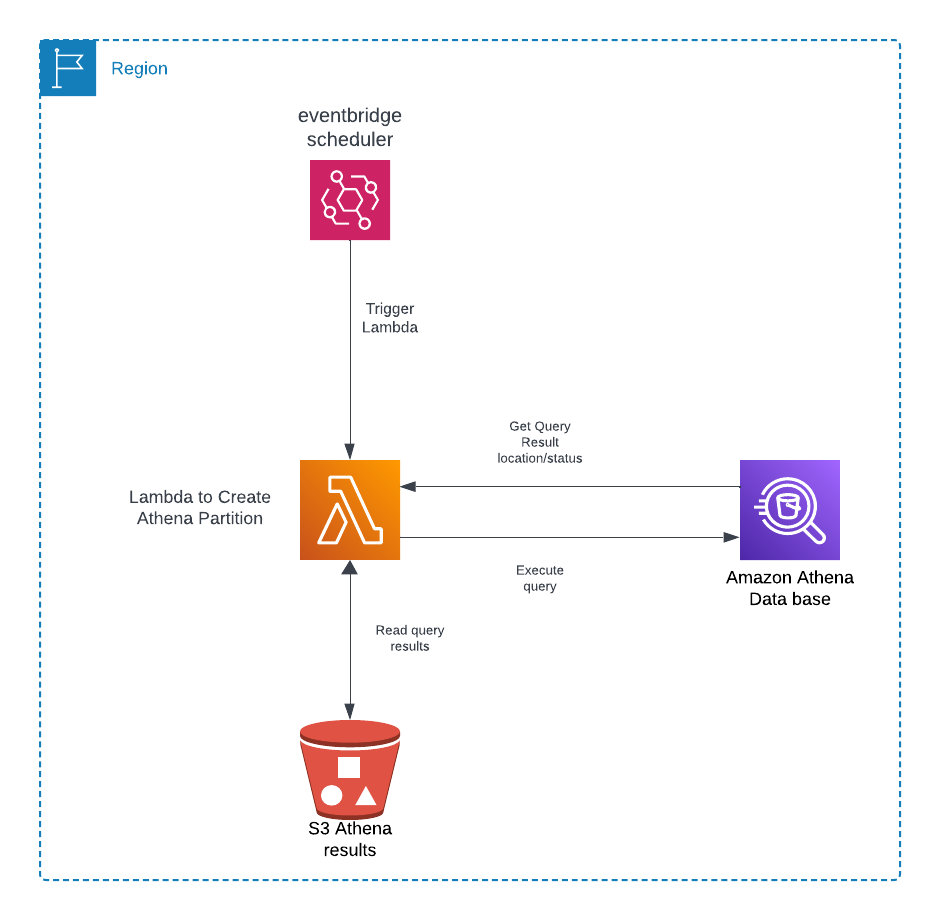

# Reload hive partition in Aws Athena

Lambda function create or reload athena partition format (Year=), scheduler by AWS event bridge scheduler to run Mon-Fri at 00:00 utc time.
Read Athena query results from S3 and compare with existing Athena Partition and add all the partition that don't match.

Deploy using terraform to create the lambda function and AWS event bridge rules.
### Aws Diagram.


### Project structure 
```txt
├── LICENSE
├── README.md
├── deploy
│        ├── assume-role-policy.json
│        ├── aws-iam-policy.json
│        └── main.tf
│
│       
└── src
    ├── config.yml
    ├── lambda_function.py
    └── reload_athena.py


```


### TO DO:
- [X] Add Terraform to deploy the project.
- [ ] Add logic to support Partition format Year/Month/Day